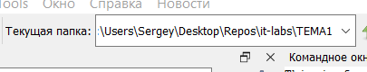

# Отчет по теме 1

Иванов Иван, А-01-24

## 1 Изучение среды GNU Octave

## 2 Настройка текущего каталога

Нажал на окно рядом с *Текущая папка:* и установил путь к папке ТЕМА1:



...

## 6 Создание матриц и векторов

```matlab
>> A=randn(4,6)
    A =

    -0.487249   1.500163  -0.058514   0.447870  -0.831425   0.230160
    0.042227   0.690096  -0.052365   1.305950  -0.379213  -0.269474
    0.654921   0.941014   0.093497   0.561096   0.212812  -0.410104
    -0.148194  -0.678435  -1.008628   1.425202   0.760093  -2.166047
```