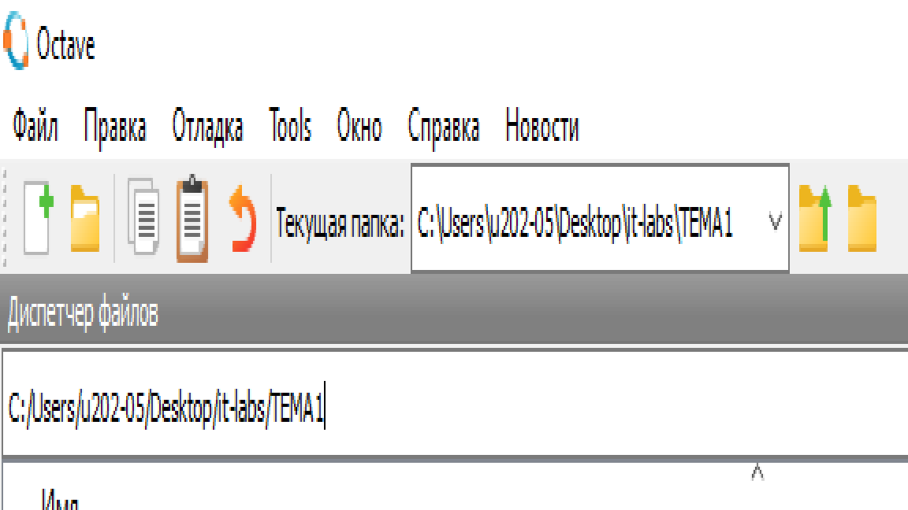
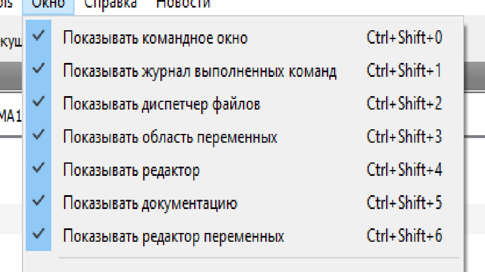
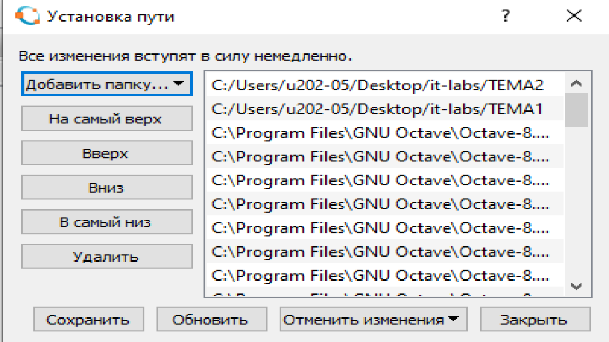
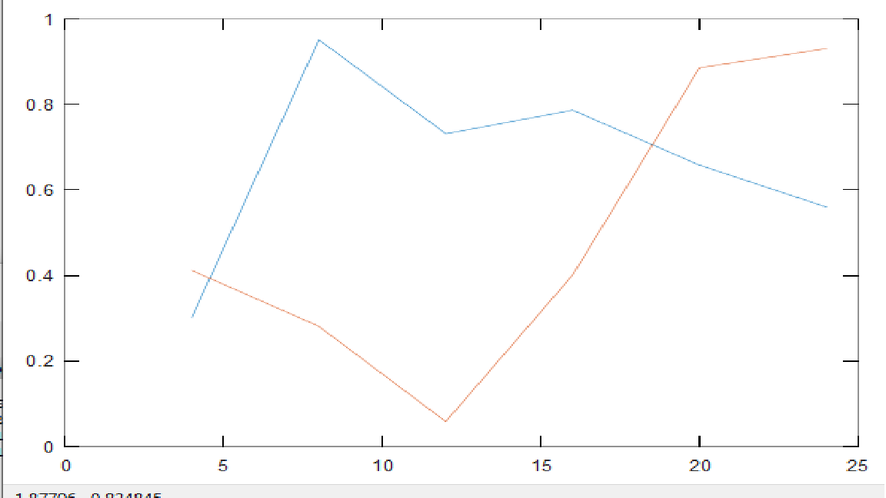
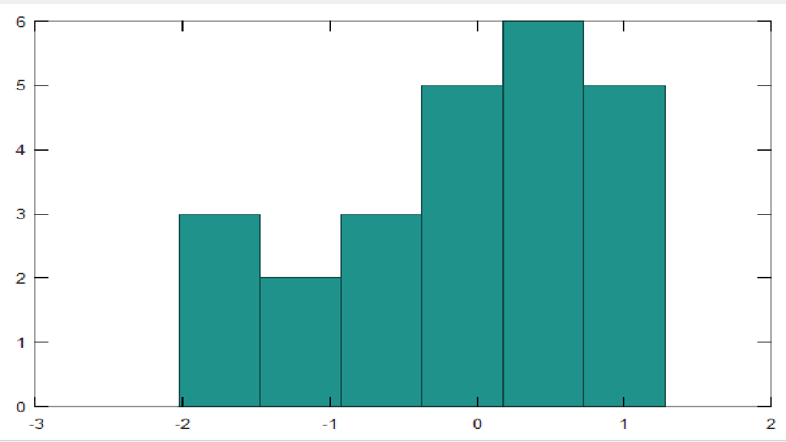
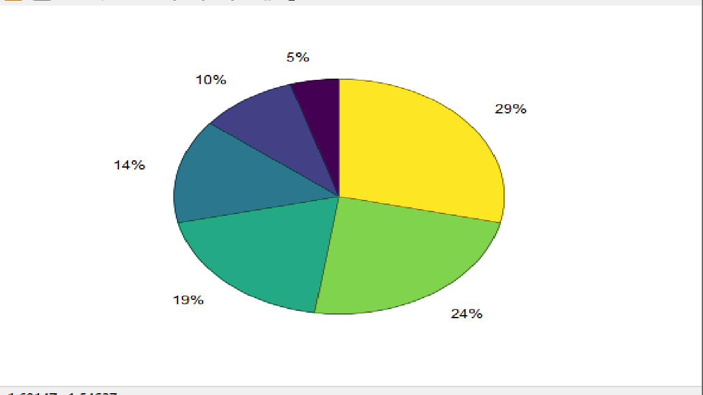
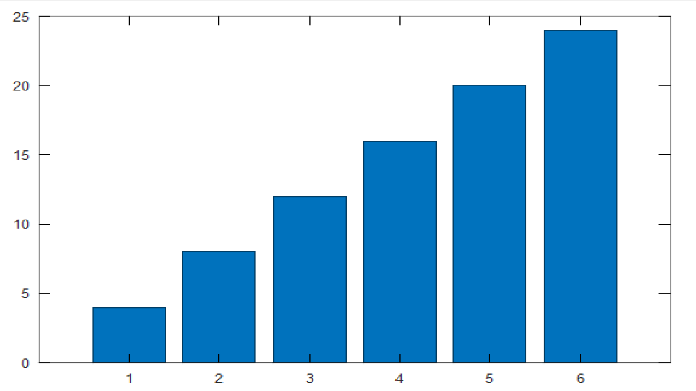

# Отчет по теме 1

Клименченко Иван, А-03-24

## 1 Изучение среды GNU Octave

## 2 Настройка текущего католога 

Нажал на окно рядом с *Текущая папка:* и установил путь к папке TEMA1:



## 3 Работа с предложением *Окно*

Отметил галочками предложения, которые указаны в методическом задании:



## 4 Отображение списка файлов, размещенных в текущей папке

Выбрал в главном меню предложения "Правка" + "Установить путь" и добавил в появившийся список пути к папкам TEMA1 и TEMA2:



## 5 Изучил работу  с системной помощи

3 способа взаимодействия с системой помощи:

-В главном меню выберите предложения «Справка» + « Документация» + « На диске».

-Ввод в командную строку help randn.

-Также можно использовать функции из дополнительных пакетов. Список пакетов можно получить выбрав в меню «Справка» + «Пакеты Octave».


## 6 Создание матрицы

Создал матрицу A с размерами 4x6 и случайными, нормально распределенными элементами:

```matlab
>> A = randn(4, 6)
A =

  -0.2627  -1.5135   1.0131  -1.0967  -0.6512   0.1109
  -0.2312   0.8284   0.2978  -1.8087   0.3552  -1.0800
   1.1199   0.8738  -0.9543  -0.6367   2.3166   2.8992
   1.2220   0.5852  -0.7575  -0.9225  -1.0620  -1.9204
```

Создал матрицу B с размерами 4x7, со случайными элементами, равномерно распределенными в диапазоне от 0 до 1:

```matlab
>> B =

   9.8683e-01   5.4813e-02   4.4655e-04   9.7877e-01   8.1614e-01   2.6225e-01   8.3845e-01
   1.2406e-01   5.7536e-01   5.1035e-01   8.9276e-01   9.1942e-01   3.4387e-01   8.3508e-02
   5.3247e-01   8.1406e-01   3.9340e-02   6.8435e-01   5.6700e-01   5.7863e-01   2.0870e-01
   3.7277e-01   7.7312e-01   4.3533e-01   7.7234e-01   5.2089e-01   3.2629e-01   7.6596e-01
```

Создал вектор C с целыми числами от 4 до 27:

```matlab
>> C =

    4    5    6    7    8    9   10   11   12   13   14   15   16   17   18   19   20   21   22   23   24   25   26   27
```

Создал сивольный вектор H:

```matlab
ࠀH = This is a symbols vector
```

Создал вектор-строку L с 2 комплексными элементами:

```matlab
L =

   -2.0000 + 23.1000i    3.0000 -  5.6000i
```

## 7 Выполнение следующих операций

Преобразовал матрицу C в матрицу с 6 столбцами:

```matlab
>> D = reshape(C, [], 6)
D =

    4    8   12   16   20   24
    5    9   13   17   21   25
    6   10   14   18   22   26
    7   11   15   19   23   27

>>
```

Сделал матричное перемножение B и A с транспонированием матрицы B:

```matlab
>> E = B'*A
E =

   0.763907  -0.707394   0.246248  -1.989562   0.239032   0.803356
   1.708982   1.557434  -1.135610  -2.332250   1.233447   0.260085
   0.457931   0.711236  -0.214877  -1.350198  -0.190194  -1.273128
   1.246681   0.308146   0.019386  -3.836352   0.444831  -0.354784
   0.844570   0.326688   0.165011  -3.399539   0.555408  -0.258938
   0.898331   0.584501  -0.431238  -1.578960   0.945284   0.708676
   0.930138  -0.569234   0.094963  -1.910080  -0.846337  -0.863086

>>
```

Создал матрицы путем горизонтального соединения матриц A и B:

```matlab

>> F=[A,B]
F =

 Columns 1 through 10:

  -2.6269e-01  -1.5135e+00   1.0131e+00  -1.0967e+00  -6.5123e-01   1.1094e-01   9.8683e-01   5.4813e-02   4.4655e-04   9.7877e-01
  -2.3115e-01   8.2841e-01   2.9780e-01  -1.8087e+00   3.5521e-01  -1.0800e+00   1.2406e-01   5.7536e-01   5.1035e-01   8.9276e-01
   1.1199e+00   8.7381e-01  -9.5427e-01  -6.3666e-01   2.3166e+00   2.8992e+00   5.3247e-01   8.1406e-01   3.9340e-02   6.8435e-01
   1.2220e+00   5.8520e-01  -7.5751e-01  -9.2251e-01  -1.0620e+00  -1.9204e+00   3.7277e-01   7.7312e-01   4.3533e-01   7.7234e-01

 Columns 11 through 13:

   8.1614e-01   2.6225e-01   8.3845e-01
   9.1942e-01   3.4387e-01   8.3508e-02
   5.6700e-01   5.7863e-01   2.0870e-01
   5.2089e-01   3.2629e-01   7.6596e-01

>>

```

Поэлементарно перемножил матрицы A и D:

```matlab

>> G = A.*D
G =

   -1.0507  -12.1081   12.1577  -17.5477  -13.0246    2.6625
   -1.1558    7.4557    3.8714  -30.7476    7.4594  -27.0012
    6.7193    8.7381  -13.3598  -11.4599   50.9642   75.3801
    8.5537    6.4372  -11.3627  -17.5277  -24.4256  -51.8517

>>
```

Поэлементарно поделил элементы матрицы G на 4.5:

```matlab

>> M =G./4.5
M =

   -0.2335   -2.6907    2.7017   -3.8995   -2.8943    0.5917
   -0.2568    1.6568    0.8603   -6.8328    1.6576   -6.0003
    1.4932    1.9418   -2.9688   -2.5466   11.3254   16.7511
    1.9008    1.4305   -2.5250   -3.8951   -5.4279  -11.5226

>>
```

Поэлементарно возвел в степень элементы матрицы D:

```matlab

>> DDD = D.^3
DDD =

      64     512    1728    4096    8000   13824
     125     729    2197    4913    9261   15625
     216    1000    2744    5832   10648   17576
     343    1331    3375    6859   12167   19683

>>

```

Создал логическую матрицу, совпадающей по размерам с D и с элементами по заданному условию:

```matlab

>> DL = D>=20
DL =

  0  0  0  0  1  1
  0  0  0  0  1  1
  0  0  0  0  1  1
  0  0  0  0  1  1

>>

```

Превратил матрицу в вектор-столбец:

```matlab

>> Dstolb=D(:)
Dstolb =

    4
    5
    6
    7
    8
    9
   10
   11
   12
   13
   14
   15
   16
   17
   18
   19
   20
   21
   22
   23
   24
   25
   26
   27

>>

```

## 8 Изучение стандартных функций

- Математические:

Корень:

```matlab
>> B1 = sqrt(B)
B1 =

   0.8912   0.9154   0.9021   0.3777   0.3581   0.8524   0.9841
   0.8425   0.9363   0.6363   0.5124   0.8517   0.8594   0.9475
   0.6334   0.7961   0.1955   0.8046   0.6285   0.6864   0.6258
   0.2281   0.9763   0.6498   0.6754   0.5494   0.5486   0.2590
>>
```

Логарифм:

```matlab
>> B2 = log(B)
B2 =

  -0.230335  -0.176863  -0.206056  -1.947159  -2.053980  -0.319505  -0.032061
  -0.342772  -0.131694  -0.904073  -1.337481  -0.321073  -0.303043  -0.107793
  -0.913373  -0.456068  -3.264437  -0.434910  -0.928981  -0.752687  -0.937477
  -2.956341  -0.047999  -0.862111  -0.784873  -1.197907  -1.200803  -2.702224

>>
```

Синус:
```matlab
>> B3 = sin(B)
B3 =

   0.713350   0.743236   0.726893   0.142195   0.127873   0.664264   0.824007
   0.651682   0.768574   0.393942   0.259502   0.663413   0.673229   0.781966
   0.390494   0.592187   0.038209   0.603053   0.384768   0.453866   0.381681
   0.051985   0.815235   0.409832   0.440520   0.297264   0.296430   0.067006

>>
```

- Операции с матрицами:

Длина матрицы:

```matlab
>> k = length(B1)
k = 7
>>
```

Размер матрицы:
```matlab
>> nm = size(B1)
nm =

   4   7

>>
```

Кол-во элементов в матрице:
```matlab
>> elem = numel(B1)
elem = 28
>>
```

Вектор линейного интервала:
```matlab
>> NN = linspace(11.5,34.1,20)
NN =

 Columns 1 through 15:

   11.500   12.689   13.879   15.068   16.258   17.447   18.637   19.826   21.016   22.205   23.395   24.584   25.774   26.963   28.153

 Columns 16 through 20:

   29.342   30.532   31.721   32.911   34.100

>>
```

Матрица единиц:
```matlab
>> FF = ones(2,4)
FF =

   1   1   1   1
   1   1   1   1

>>
```

Матрица нулей:
```matlab
>> GG = zeros(5)
GG =

   0   0   0   0   0
   0   0   0   0   0
   0   0   0   0   0
   0   0   0   0   0
   0   0   0   0   0

>>
```

Диагональ матрицы:
```matlab
>> B1D=diag(B1)
B1D =

   0.8912
   0.9363
   0.1955
   0.6754

>>
```

Диагональная матрица из вектора:
```matlab
>> DB = diag(B1D)
DB =

Diagonal Matrix

    0.8912        0        0        0
        0   0.9363        0        0
        0        0   0.1955        0
        0        0        0   0.6754

>>
```

Сортировка в столбцах:
```matlab
>> BS1=sort(B)
BS1 =

   0.052009   0.633771   0.038218   0.142679   0.128224   0.300953   0.067056
   0.401169   0.837894   0.404917   0.262506   0.301825   0.471099   0.391615
   0.709800   0.876609   0.422270   0.456178   0.394956   0.726509   0.897813
   0.794267   0.953135   0.813787   0.647323   0.725370   0.738567   0.968447

>>
```

Сортировка по 2 столбцу:
```matlab
>> BS2=sortrows(B,2)
BS2 =

   0.401169   0.633771   0.038218   0.647323   0.394956   0.471099   0.391615
   0.794267   0.837894   0.813787   0.142679   0.128224   0.726509   0.968447
   0.709800   0.876609   0.404917   0.262506   0.725370   0.738567   0.897813
   0.052009   0.953135   0.422270   0.456178   0.301825   0.300953   0.067056
>>
```

Сумма каждого столбца:
```matlab
>> DS1=sum(D)
DS1 =

    22    38    54    70    86   102

>>
```

Сумма каждой строки:
```matlab
>> DS2 = sum(D,2)
DS2 =

    84
    90
    96
   102

>>
```

Произведение по столбцам:
```matlab
>> DP1 = prod(D)
DP1 =

      840     7920    32760    93024   212520   421200

>>
```

Определитель:
```matlab
>> dt=det(A*A')
dt = 654.00
>>
```

Обратная матрица:
```matlab
฀>> dinv = inv(A*A')
dinv =

   0.8194  -0.3173   0.4800  -0.2872
  -0.3173   0.2928  -0.2075   0.1266
   0.4800  -0.2075   0.3753  -0.1545
  -0.2872   0.1266  -0.1545   0.1674

>>
```

## 9 Изучение работы с индексацией элементов матрицы

Элемент 3 строки 5 столбца:
```matlab
>> D1 = D(3,5)
D1 = 22
>>
```

Часть 3 строки с 4 по последний столбцы:
```matlab
ࠀ>> D2 = D(3,4:end)
D2 =

   18   22   26

>>
```

Кусок матрицы:
```matlab
>> D3 = D(2:3,3:5)
D3 =

   13   17   21
   14   18   22

>>
```

Элементы с 16 по 20 место:
```matlab
>> D4 = D(16:20)
D4 =

   19   20   21   22   23

>>
```

Смешанная матрица:
```matlab
>> D5 = D(3:4,[1,3,6])
D5 =

    6   14   26
    7   15   27

>>
```

## 10 Изучение некоторых управляющих конструкций

Цикл по перечислению:

```matlab
>> Dsum=0
Dsum = 0
>> for i=1:6
Dsum=Dsum+sqrt(D(2,i))
endfor
Dsum = 2.2361
Dsum = 5.2361
Dsum = 8.8416
Dsum = 12.965
Dsum = 17.547
Dsum = 22.547
>>
```

Цикл пока выполняется условие:

```matlab
>> Dsum2=0;i=1
i = 1
>> while (D(i)<22)
Dsum2=Dsum2+sin(D(i))
i=i+1
endwhile
Dsum2 = -0.7568
i = 2
Dsum2 = -1.7157
i = 3
Dsum2 = -1.9951
i = 4
Dsum2 = -1.3382
i = 5
Dsum2 = -0.3488
i = 6
Dsum2 = 0.063321
i = 7
Dsum2 = -0.4807
i = 8
Dsum2 = -1.4807
i = 9
Dsum2 = -2.0173
i = 10
Dsum2 = -1.5971
i = 11
Dsum2 = -0.6065
i = 12
Dsum2 = 0.043799
i = 13
Dsum2 = -0.2441
i = 14
Dsum2 = -1.2055
i = 15
Dsum2 = -1.9565
i = 16
Dsum2 = -1.8066
i = 17
Dsum2 = -0.8937
i = 18
Dsum2 = -0.057011
i = 19
>>
```

Условие if:

```matlab
>> if (D(3,5)>=20)
printf('D(3,5)>=20')
else
printf('D(3,5)<20')
endif
D(3,5)>=20>>
```

## 11 Использование графических функций

Функция построения графиков:

```matlab
plot(D(1,:),B([2,4],1:6))
```



Функция расчета и построения гистограммы:

```matlab
hist(A(:),6)
```



Функция pie:

```matlab
pie(C)
```



Функция bar:

```matlab
bar(C)
```



## 12 Работа с текстовым редактором

Создал сценарий и перенес все выполненные команды из п.9:


Убедился в работоспособности программы с помощью кнопки F5 и ввода имени файла в командной строке.

## Сохранение и восстановление переменных

Сохранил содержимое области переменных в файле Perem, завершил работу со средой и снова запустил среду. С помощью комманд восстановил содержимое из области файла Perem. Убедился в том, что в журнале выполненных команд сохранены команды из предыдущего сеанса работы со средой.