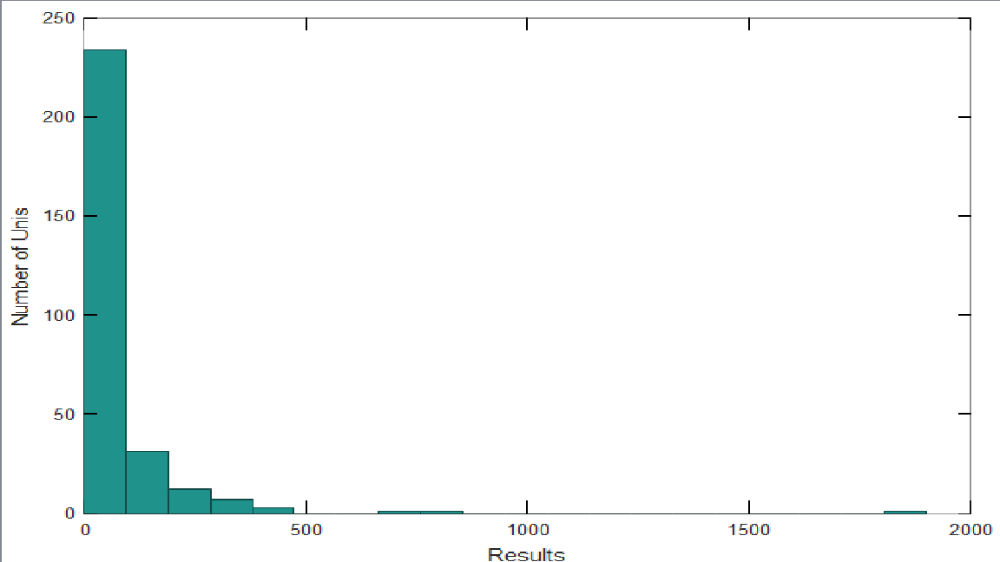
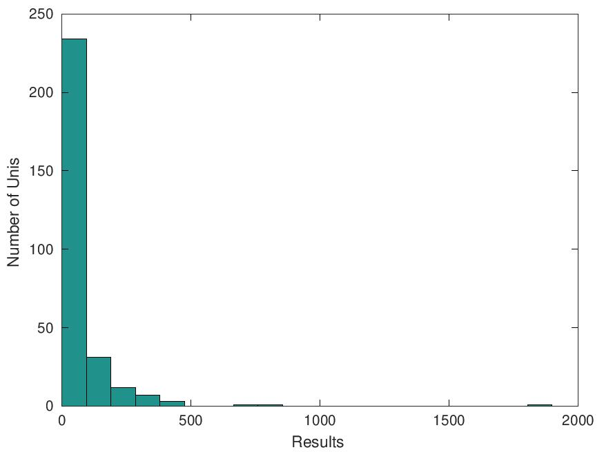

# Вторая лаба отчет

## 1 Пункт

Устанавливаю текущую директорию проекта

## 2 Пункт

### Читаю файл и проверяю размер матрицы

```matlab
XX=load('dan_vuz.txt')
size(XX)
```
```matlab
ans =

   290    15

>>
```
### Данные о скольких вузах России представлены в этой матрице?

290

### Выделите в отдельную матрицу данные о показателях результативности:
```matlab
X=XX(:,3:13)
```
### Рассчитайте матрицу корреляций между показателями результативности:
```matlab
R=corr(X)
```
```matlab
R =

 Columns 1 through 10:

   1.0000e+00   4.4320e-01   4.5229e-01   4.4779e-01   3.8123e-01   4.6516e-01   3.1487e-01   6.5579e-02   2.9153e-01   4.8811e-01
   4.4320e-01   1.0000e+00   8.5319e-01   8.5331e-01   8.6240e-01   8.5436e-01   5.5145e-01   2.5082e-02   4.2348e-01   8.2170e-01
   4.5229e-01   8.5319e-01   1.0000e+00   8.4660e-01   8.8651e-01   9.0335e-01   5.5091e-01   3.8840e-03   4.4396e-01   7.8358e-01
   4.4779e-01   8.5331e-01   8.4660e-01   1.0000e+00   8.7038e-01   9.3849e-01   7.0924e-01   4.9500e-02   4.5873e-01   8.5183e-01
   3.8123e-01   8.6240e-01   8.8651e-01   8.7038e-01   1.0000e+00   9.3605e-01   5.7668e-01   3.7562e-02   3.8322e-01   7.7266e-01
   4.6516e-01   8.5436e-01   9.0335e-01   9.3849e-01   9.3605e-01   1.0000e+00   6.3033e-01   4.7121e-02   4.7592e-01   8.3810e-01
   3.1487e-01   5.5145e-01   5.5091e-01   7.0924e-01   5.7668e-01   6.3033e-01   1.0000e+00   7.9448e-02   4.1878e-01   6.2936e-01
   6.5579e-02   2.5082e-02   3.8840e-03   4.9500e-02   3.7562e-02   4.7121e-02   7.9448e-02   1.0000e+00   4.7985e-02   5.6462e-02
   2.9153e-01   4.2348e-01   4.4396e-01   4.5873e-01   3.8322e-01   4.7592e-01   4.1878e-01   4.7985e-02   1.0000e+00   6.2616e-01
   4.8811e-01   8.2170e-01   7.8358e-01   8.5183e-01   7.7266e-01   8.3810e-01   6.2936e-01   5.6462e-02   6.2616e-01   1.0000e+00
   3.9815e-01   2.6183e-01   2.6408e-01   3.4420e-01   1.8751e-01   3.3118e-01   2.8287e-01   1.3662e-01   4.5537e-01   3.8799e-01

 Column 11:

   3.9815e-01
   2.6183e-01
   2.6408e-01
   3.4420e-01
   1.8751e-01
   3.3118e-01
   2.8287e-01
   1.3662e-01
   4.5537e-01
   3.8799e-01
   1.0000e+00

>>
```
### Пусть для исследования результативности применяется метод главных компонент, основу которого составляет получение собственных значений и собственных векторов от квадратичной формы:
```matlab
[vect,lambda]=eig(X'*X)
```
```matlab
lambda =

Diagonal Matrix

 Columns 1 through 10:

   2.2947e+01            0            0            0            0            0            0            0            0            0
            0   1.9317e+03            0            0            0            0            0            0            0            0
            0            0   2.5940e+03            0            0            0            0            0            0            0
            0            0            0   3.4573e+03            0            0            0            0            0            0
            0            0            0            0   5.6252e+03            0            0            0            0            0
            0            0            0            0            0   8.6721e+03            0            0            0            0
            0            0            0            0            0            0   1.8915e+04            0            0            0
            0            0            0            0            0            0            0   4.7523e+04            0            0
            0            0            0            0            0            0            0            0   5.7484e+04            0
            0            0            0            0            0            0            0            0            0   2.2565e+05
            0            0            0            0            0            0            0            0            0            0

 Column 11:

            0
            0
            0
            0
            0
            0
            0
            0
            0
            0
   7.4946e+06

>>
```
```matlab
Sobst=diag(lambda);
```
### Представьте их на экране с заголовком:
```matlab
fprintf('Eigenvalues:\n %f \n',Sobst)
```
```matlab
Eigenvalues:
 22.946585
Eigenvalues:
 1931.665464
Eigenvalues:
 2593.979592
Eigenvalues:
 3457.339562
Eigenvalues:
 5625.151474
Eigenvalues:
 8672.065947
Eigenvalues:
 18914.627989
Eigenvalues:
 47522.678185
Eigenvalues:
 57483.681267
Eigenvalues:
 225653.068540
Eigenvalues:
 7494628.795394
>>
```
### Выделите наибольшее собственное значение и соответствующий ему собственный вектор:
```matlab
>> SobMax=Sobst(end)
SobMax = 7.4946e+06
```
```matlab
>> GlComp=vect(:,end)
GlComp =

   3.5306e-02
   4.6772e-02
   4.8953e-02
   6.1556e-01
   2.4277e-01
   7.3685e-01
   9.5893e-02
   1.6945e-04
   1.7911e-02
   5.9523e-02
   1.7425e-02

>>
```
### Рассчитайте долю информации о результативности НИР, содержащуюся в главной компоненте и отобразите ее на экране:
```matlab
>> Delt=100*SobMax/sum(Sobst)
Delt = 95.273
```
```matlab
>> fprintf('Delta= %d \n ',round(Delt))
Delta= 95
```
### С использованием главной компоненты рассчитайте оценки обобщенной результативности в каждом из представленных в матрице вузов и отобразите ее с указанием кода вуза:
```matlab
Res=X*GlComp
fprintf(' Results \n ')
fprintf('%d  %f \n ',[XX(:,1),Res] ')
```
получаю вывод формата **Results \n {results}**

### Сохраните вектор оценок результативности в отдельном бинарном (mat) файле:
```matlab
save res.mat Res -mat
```
в рабочей папке появляется файл res.mat

### Представьте распределение оценок результативности в виде гистограммы с 20 интервалами  и с обозначением осей:
```matlab
xlabel('Results ')
ylabel('Number of Unis ')
hist(Res,20)
```

```matlab
saveas(gcf, 'Hist.jpg ', 'jpg ')
```
в папке появлися новый файл Hist

### Наконец, рассчитайте и отобразите оценку корреляции обобщенной результативности с финансированием, выделенным на проведение НИР:
```matlab
CorFin=corr(Res,XX(:,2))
fprintf('Correlation of Results and Money = %f \n',CorFin)
```
Вывод:
```matlab
Correlation of Results and Money = 0.843710
>>
```
## Пункт 3

Создаю файл, содержащий такие строки:
```matlab
warning('off', 'all')
graphics_toolkit('gnuplot')
XX=load('dan_vuz.txt')
X=XX(:,3:13)
R=corr(X)
[vect,lambda]=eig(X'*X)
Sobst=diag(lambda);
SobMax=Sobst(end)
GlComp=vect(:,end)
Delt=100*SobMax/sum(Sobst)
Res=X*GlComp
xlabel('Results ')
ylabel('Number of Unis '))
hist(Res,20)
saveas(gcf, 'Hist.jpg ', 'jpg ')
```
выводы в консоли совпадают с теми, что были ранее, рисунок так же совпадает



## 4 Пункт

Я поставил **;** в конце каждой строки скрипта и добавил отладочный принт, чтобы точно видеть завершение работы программы и отсутствие других выводов ```fprintf('Выполнение завершено')```
```matlab
>> tri --> мой файл
```
```matlab
DEBUG: FC_WEIGHT didn't match --> такая ошибка уже была, ниче страшного
Выполнение завершено>>
```
## 5 пункт

сделал все выводы в файл
```matlab
warning('off', 'all');
graphics_toolkit('gnuplot');
fp=fopen('prtcl.txt ','w')
XX=load('dan_vuz.txt');
X=XX(:,3:13);
R=corr(X);
[vect,lambda]=eig(X'*X);
Sobst=diag(lambda);
fprintf(fp,'Eigenvalues:\n %f \n',Sobst)
fprintf(fp, '\n')
SobMax=Sobst(end);
GlComp=vect(:,end);
Delt=100*SobMax/sum(Sobst);
fprintf(fp, 'Delta= %d \n ',round(Delt))
Res=X*GlComp;
fprintf(fp, ' Results \n ')
fprintf(fp, '%d  %f \n ',[XX(:,1),Res] ')
hist(Res,20);
xlabel('Results ');
ylabel('Number of Unis ');
saveas(gcf, 'Hist.jpg ', 'jpg ');
fclose(fp)
```
Выходной файл -> [prtcl.txt](prtcl.txt)

## 6 пункт

код с выводом в файл:
```matlab
warning('off', 'all');
graphics_toolkit('gnuplot');
fp=fopen('prtcl.txt ','w')
XX=load('dan_vuz.txt');
X=XX(:,3:13);
R=corr(X);
[vect,lambda]=eig(X'*X);
Sobst=diag(lambda);
fprintf(fp,'Eigenvalues:\n %f \n',Sobst)
fprintf(fp, '\n')
SobMax=Sobst(end);
GlComp=vect(:,end);
Delt=100*SobMax/sum(Sobst);
fprintf(fp, 'Delta= %d \n ',round(Delt))
Res=X*GlComp;

minres = min(Res)
maxres = max(Res)
meanres = mean(Res)
stdres = std(Res)

fprintf(fp, ' Results \n ')
fprintf(fp, '%d  %f \n ',[XX(:,1),Res] )
# fprintf(fp, 'min: %f', minres, '\n', 'max: %f', maxres, '\n', 'mean: %f', meanres, '\n', 'std: %f', stdres)
fprintf(fp, 'min: %f\n max: %f\n mean: %f \n std: %f', [minres, maxres, meanres, stdres])
hist(Res,20);
xlabel('Results ');
ylabel('Number of Unis ');
saveas(gcf, 'Hist.jpg ', 'jpg ');
fclose(fp)
```
вывод метрик в конце:
```matlab
min: 0.000000
max: 1898.884523
mean: 67.928804 
std: 145.954386
```
# Контрольное задание
### Задача:
В том же файле dan_vuz.txt содержатся сведения о кадровом составе участников НИР в вузах. В столбцах 14 и 15 - числа сотрудников профессорско-преподавательского состава и  студентов, участвовавших в НИР в соответствующем вузе в отчетном году.
По аналогии с исследованием, проведенным при выполнении темы, необходимо 
- рассчитать главную компоненту, представляющую показатель обобщенного кадрового обеспечения НИР в каждом вузе, 
- определить и отобразить долю представления в этом показателе информации о кадрах, 
- рассчитать и вывести в некоторый текстовый файл значения показателя для каждого вуза,
- рассчитать и отобразить корреляции этого показателя с финансированием НИР,
- рассчитать и отобразить корреляцию между показателями результативности и кадрового обеспечения.
Команды, выполняющие эти операции представьте в виде программы, записанной в файл-сценарий. Проверьте работоспособность этой программы.

## код решения:
```matlab
XX = load('dan_vuz.txt');

X = XX(:, 3:13);
[vect_X, lambda_X] = eig(X'*X);
GlComp_X = vect_X(:, end);
Res = X * GlComp_X;

Y = XX(:, 14:15);

[vect_Y, lambda_Y] = eig(Y'*Y);
Sobst_Y = diag(lambda_Y);
SobMax_Y = Sobst_Y(end);
GlComp_Y = vect_Y(:, end);

Delt_Y = 100 * SobMax_Y / sum(Sobst_Y);
fprintf('Доля информации о кадрах: %d%%\n', round(Delt_Y));

StaffRes = Y * GlComp_Y;

fp_staff = fopen('staff_prtcl.txt', 'w');
fprintf(fp_staff, 'Код вуза | Кадровое обеспечение\n');
fprintf(fp_staff, '%d \t %f\n', [XX(:,1), StaffRes]');
fclose(fp_staff);

CorStaffFin = corr(StaffRes, XX(:,2));
fprintf('Корреляция кадров и финансирования = %f\n', CorStaffFin);

CorResStaff = corr(Res, StaffRes);
fprintf('Корреляция результативности и кадров = %f\n', CorResStaff);
```

## Вывод:
```matlab
Доля информации о кадрах: 96%
Корреляция кадров и финансирования = -0.913020
Корреляция результативности и кадров = -0.927138
```

## Выходной файл:
[staff_prtcl.txt](staff_prtcl.txt)